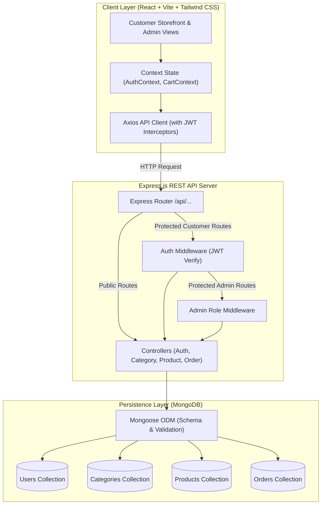
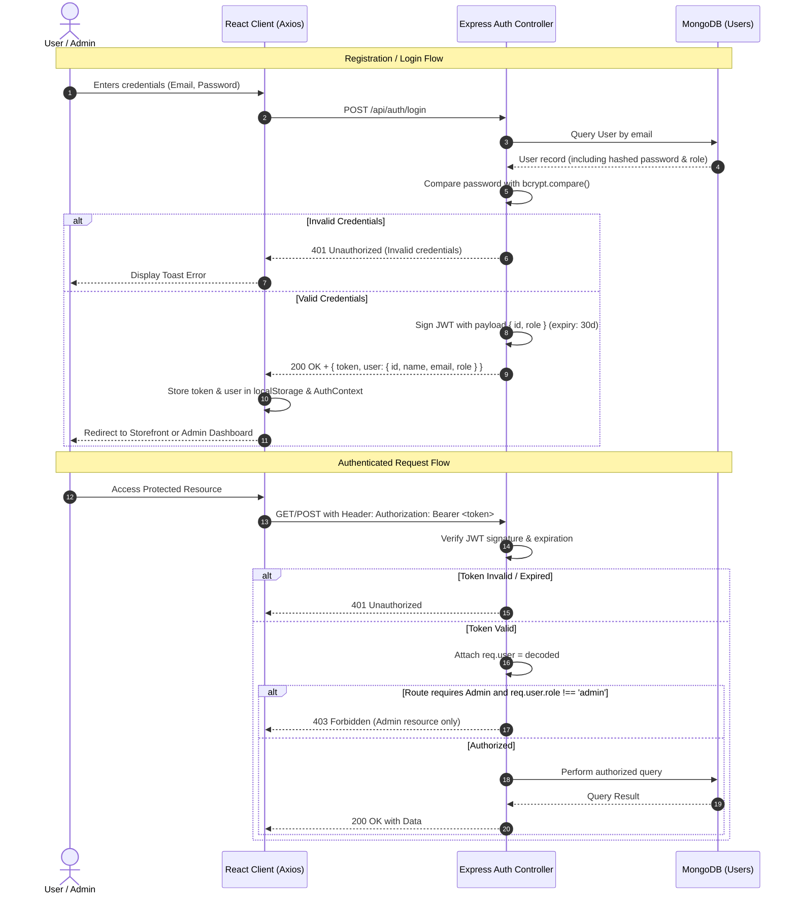
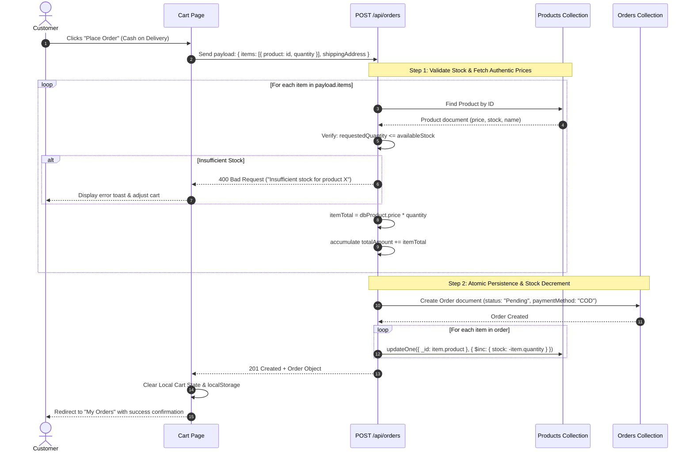
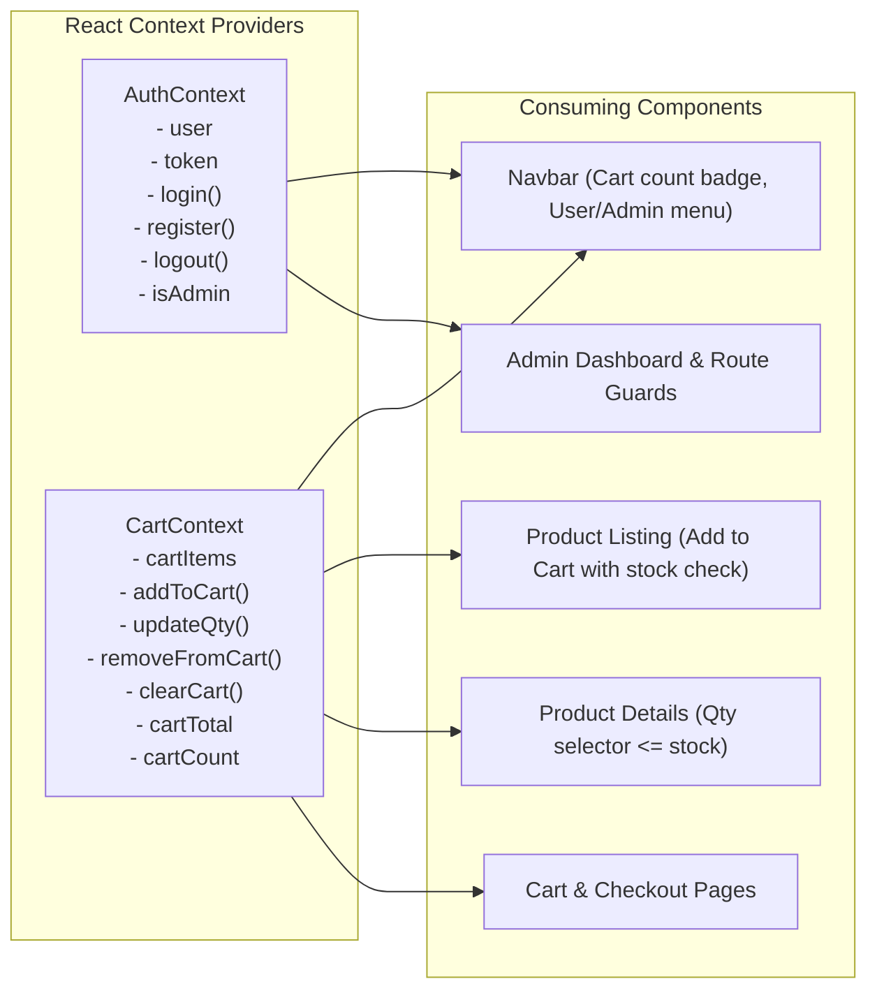

# System Architecture & Technical Design

This document details the architectural design, security protocols, component boundaries, and data flow mechanisms for the **Mini E-Commerce Demo Project (MERN Stack)**.

---

## 1. High-Level System Architecture

The application adopts a decoupled client-server architecture:
* **Presentation Layer (`/client`)**: React Single Page Application (SPA) bundled with Vite, styled with Tailwind CSS, communicating asynchronously via Axios.
* **API / Application Layer (`/server`)**: Node.js runtime executing an Express.js REST application with modular controllers, service helpers, and middleware pipelines.
* **Persistence Layer (`MongoDB`)**: Document database accessed via Mongoose ODM for schema enforcement, validation, indexing, and relational references.

---

## 2. Authentication & Authorization Lifecycle

Role-based access control (RBAC) separates **Customer** and **Admin** permissions using JSON Web Tokens (JWT).

---

## 3. Order Processing & Inventory Flow

To guarantee transaction integrity and avoid fraud, **the client never dictates product prices or stock deductions**. All calculations are performed server-side.

---

## 4. Frontend State Architecture

* **Stock Safeguards**: The `CartContext` checks item stock before incrementing. If an item has `stock: 3`, the quantity selector disables increment at `3`.
* **Axios Interceptor**: Automatically attaches `Authorization: Bearer <token>` to all outgoing requests and catches `401 Unauthorized` responses to trigger clean logouts.

---

## 5. Security & Data Integrity Matrix

| Risk | Mitigation Strategy | Implemented In |
| :--- | :--- | :--- |
| **Client-Side Price Tampering** | Backend fetches product price from DB; ignores any price sent in request body | `orderController.js` |
| **Overselling / Negative Stock** | Backend validates `stock >= quantity` and rejects orders before decrementing | `orderController.js` |
| **Unauthorized Admin Access** | Multi-layered route protection: JWT verification + `req.user.role === 'admin'` check | `authMiddleware.js`, `adminMiddleware.js` |
| **Password Exposure** | Passwords hashed using bcrypt (10 rounds); passwords excluded from JSON queries (`select("-password")`) | `User.js`, `authController.js` |
| **Database Injection** | Strict Mongoose Schema typing and object parameterization | All Mongoose Models |
| **Invalid Enum Statuses** | Order status strictly bounded to `['Pending', 'Confirmed', 'Shipped', 'Delivered', 'Cancelled']` | `Order.js` model & status controller |
