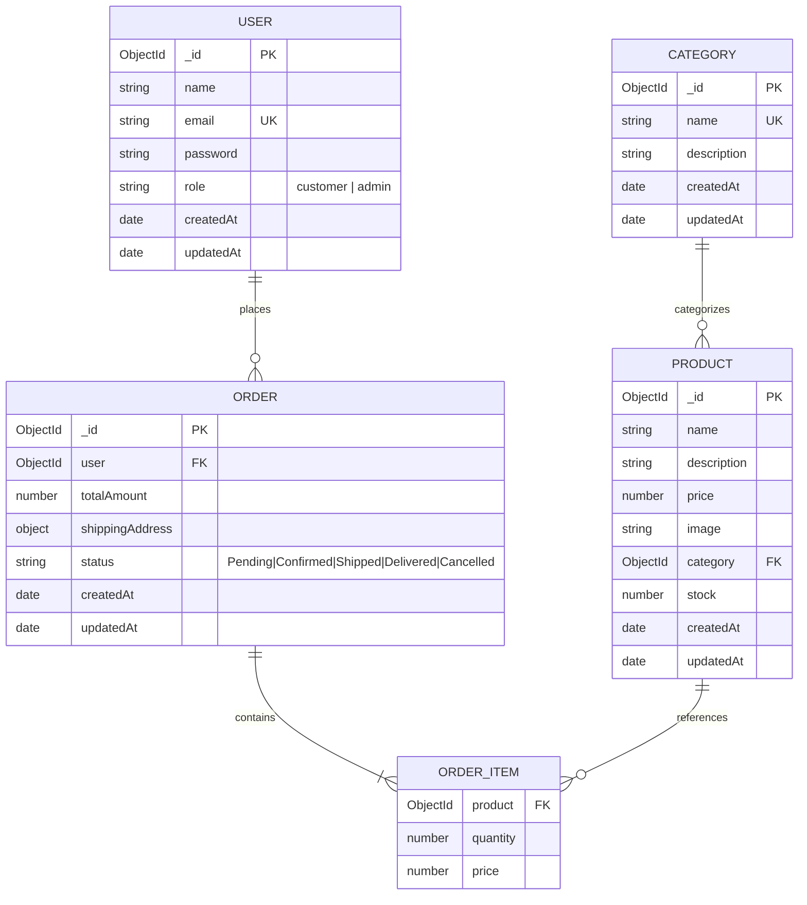

# Database Models & Schema Specifications

This document defines the database schemas, relational connections, indexing strategies, and validation rules for **MongoDB** using **Mongoose ODM**.

---

## 1. Entity Relationship Diagram (ERD)



---

## 2. Model 1: User Schema (`User.js`)

Represents both regular customers and administrative staff.

### Data Dictionary
| Field | Type | Required | Default | Validation & Notes |
| :--- | :--- | :--- | :--- | :--- |
| `_id` | ObjectId | Auto | Auto | Primary Key |
| `name` | String | Yes | - | Trimmed, 2 to 60 characters |
| `email` | String | Yes | - | Unique, lowercase, valid email regex pattern |
| `password` | String | Yes | - | Hashed via `bcryptjs` (salt 10 rounds), min 6 chars before hash |
| `role` | String | Yes | `"customer"` | Enum: `["customer", "admin"]` |
| `createdAt` | Date | Auto | Date.now | Standard Mongoose timestamp |
| `updatedAt` | Date | Auto | Date.now | Standard Mongoose timestamp |

### Schema Definition
```javascript
import mongoose from "mongoose";
import bcrypt from "bcryptjs";

const userSchema = new mongoose.Schema(
  {
    name: {
      type: String,
      required: [true, "Name is required"],
      trim: true,
      minlength: [2, "Name must be at least 2 characters"]
    },
    email: {
      type: String,
      required: [true, "Email is required"],
      unique: true,
      lowercase: true,
      trim: true,
      match: [/^\S+@\S+\.\S+$/, "Please provide a valid email address"]
    },
    password: {
      type: String,
      required: [true, "Password is required"],
      minlength: [6, "Password must be at least 6 characters"]
    },
    role: {
      type: String,
      enum: ["customer", "admin"],
      default: "customer"
    }
  },
  { timestamps: true }
);

// Pre-save hook: Hash password if modified
userSchema.pre("save", async function (next) {
  if (!this.isModified("password")) return next();
  const salt = await bcrypt.genSalt(10);
  this.password = await bcrypt.hash(this.password, salt);
  next();
});

// Helper method: Compare password
userSchema.methods.matchPassword = async function (enteredPassword) {
  return await bcrypt.compare(enteredPassword, this.password);
};

export default mongoose.model("User", userSchema);
```

---

## 3. Model 2: Category Schema (`Category.js`)

Organizes the catalog into browsable product groups.

### Data Dictionary
| Field | Type | Required | Default | Validation & Notes |
| :--- | :--- | :--- | :--- | :--- |
| `_id` | ObjectId | Auto | Auto | Primary Key |
| `name` | String | Yes | - | Unique, trimmed, e.g. "Electronics", "Fashion", "Shoes" |
| `description` | String | No | `""` | Trimmed, optional summary of the category |
| `createdAt` | Date | Auto | Date.now | Timestamp |
| `updatedAt` | Date | Auto | Date.now | Timestamp |

### Schema Definition
```javascript
import mongoose from "mongoose";

const categorySchema = new mongoose.Schema(
  {
    name: {
      type: String,
      required: [true, "Category name is required"],
      unique: true,
      trim: true,
      maxlength: [50, "Category name cannot exceed 50 characters"]
    },
    description: {
      type: String,
      trim: true,
      default: ""
    }
  },
  { timestamps: true }
);

export default mongoose.model("Category", categorySchema);
```

---

## 4. Model 3: Product Schema (`Product.js`)

Stores item metadata, live inventory count, and pricing.

### Data Dictionary
| Field | Type | Required | Default | Validation & Notes |
| :--- | :--- | :--- | :--- | :--- |
| `_id` | ObjectId | Auto | Auto | Primary Key |
| `name` | String | Yes | - | Trimmed, product title |
| `description` | String | Yes | - | Detailed product overview |
| `price` | Number | Yes | - | Must be greater than 0 (`min: [0.01, ...]`) |
| `image` | String | Yes | - | Valid image URL or uploaded asset link |
| `category` | ObjectId | Yes | - | Reference to `Category` model |
| `stock` | Number | Yes | 0 | Non-negative integer (`min: [0, "Stock cannot be negative"]`) |
| `createdAt` | Date | Auto | Date.now | Timestamp |
| `updatedAt` | Date | Auto | Date.now | Timestamp |

### Schema Definition & Indexes
```javascript
import mongoose from "mongoose";

const productSchema = new mongoose.Schema(
  {
    name: {
      type: String,
      required: [true, "Product name is required"],
      trim: true
    },
    description: {
      type: String,
      required: [true, "Description is required"],
      trim: true
    },
    price: {
      type: Number,
      required: [true, "Price is required"],
      min: [0.01, "Price must be greater than zero"]
    },
    image: {
      type: String,
      required: [true, "Product image URL is required"]
    },
    category: {
      type: mongoose.Schema.Types.ObjectId,
      ref: "Category",
      required: [true, "Category is required"]
    },
    stock: {
      type: Number,
      required: [true, "Stock count is required"],
      min: [0, "Stock cannot be negative"],
      default: 0
    }
  },
  { timestamps: true }
);

// Compound text index for search query performance
productSchema.index({ name: "text", description: "text" });
// Index on category for rapid category filtering
productSchema.index({ category: 1 });

export default mongoose.model("Product", productSchema);
```

---

## 5. Model 4: Order Schema (`Order.js`)

Stores purchased items, customer address, locked historical purchase price, and fulfillment status.

### Data Dictionary
| Field | Type | Required | Default | Validation & Notes |
| :--- | :--- | :--- | :--- | :--- |
| `_id` | ObjectId | Auto | Auto | Primary Key |
| `user` | ObjectId | Yes | - | Reference to purchasing `User` |
| `products` | Array | Yes | - | Array of item sub-documents |
| `products[].product` | ObjectId | Yes | - | Reference to `Product` |
| `products[].quantity` | Number | Yes | 1 | Positive integer (min: 1) |
| `products[].price` | Number | Yes | - | Unit price at moment of purchase |
| `totalAmount` | Number | Yes | - | Computed server-side: sum of (item.price * item.quantity) |
| `shippingAddress.name` | String | Yes | - | Recipient name |
| `shippingAddress.phone` | String | Yes | - | Contact phone number |
| `shippingAddress.address` | String | Yes | - | Street and building address |
| `shippingAddress.city` | String | Yes | - | City name |
| `shippingAddress.pincode` | String | Yes | - | Postal PIN code |
| `status` | String | Yes | `"Pending"` | Enum: `["Pending", "Confirmed", "Shipped", "Delivered", "Cancelled"]` |
| `createdAt` | Date | Auto | Date.now | Timestamp |
| `updatedAt` | Date | Auto | Date.now | Timestamp |

### Schema Definition
```javascript
import mongoose from "mongoose";

const orderItemSchema = new mongoose.Schema(
  {
    product: {
      type: mongoose.Schema.Types.ObjectId,
      ref: "Product",
      required: true
    },
    quantity: {
      type: Number,
      required: true,
      min: [1, "Quantity must be at least 1"]
    },
    price: {
      type: Number,
      required: true,
      min: [0, "Price cannot be negative"]
    }
  },
  { _id: false }
);

const orderSchema = new mongoose.Schema(
  {
    user: {
      type: mongoose.Schema.Types.ObjectId,
      ref: "User",
      required: true
    },
    products: {
      type: [orderItemSchema],
      required: [true, "Order must contain at least one product"],
      validate: [val => val.length > 0, "Cart cannot be empty"]
    },
    totalAmount: {
      type: Number,
      required: true,
      min: [0, "Total amount cannot be negative"]
    },
    shippingAddress: {
      name: { type: String, required: [true, "Recipient name is required"] },
      phone: { type: String, required: [true, "Phone number is required"] },
      address: { type: String, required: [true, "Shipping address is required"] },
      city: { type: String, required: [true, "City is required"] },
      pincode: { type: String, required: [true, "Pincode is required"] }
    },
    status: {
      type: String,
      enum: ["Pending", "Confirmed", "Shipped", "Delivered", "Cancelled"],
      default: "Pending"
    }
  },
  { timestamps: true }
);

// Indexes for order history lookups
orderSchema.index({ user: 1, createdAt: -1 });
orderSchema.index({ status: 1 });

export default mongoose.model("Order", orderSchema);
```
