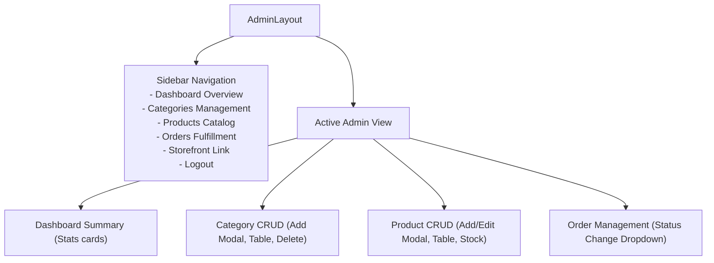

# Frontend UI/UX Specification & Component Architecture

This document defines the user interface specifications, styling standards, layout hierarchies, and interaction behaviors for the **React + Vite + Tailwind CSS** frontend.

---

## 1. Design System & Styling Tokens

### 1.1 Color Palette
The interface balances modern minimalism with energetic accents:
* **Primary (Indigo/Blue)**:
  * Brand Base: `bg-indigo-600` / `text-indigo-600`
  * Hover / Focus: `bg-indigo-700` / `ring-indigo-500`
  * Light Accent: `bg-indigo-50` / `text-indigo-700`
* **Neutral & Grayscale**:
  * Background: `bg-slate-50`
  * Card Surfaces: `bg-white`
  * Text Primary: `text-slate-900`
  * Text Muted: `text-slate-500`
  * Borders / Dividers: `border-slate-200`
* **Status Badges**:
  * `Pending`: `bg-amber-100 text-amber-800 border-amber-200`
  * `Confirmed`: `bg-blue-100 text-blue-800 border-blue-200`
  * `Shipped`: `bg-purple-100 text-purple-800 border-purple-200`
  * `Delivered`: `bg-emerald-100 text-emerald-800 border-emerald-200`
  * `Cancelled`: `bg-rose-100 text-rose-800 border-rose-200`

### 1.2 Typography & Spacing
* **Font Family**: Modern sans-serif (`Inter`, `system-ui`, `-apple-system`)
* **Responsive Breakpoints**:
  * Mobile: `< 640px` (Single column, stacked controls, mobile hamburger menu)
  * Tablet: `640px - 1024px` (2 columns grid, compact sidebar)
  * Desktop: `≥ 1024px` (3 to 4 columns grid, full sidebar)

---

## 2. Public Storefront Pages

### 2.1 Navigation Bar (`Navbar.jsx`)
* **Left**: Brand Logo & App Name ("ShopWave Mini")
* **Center**: Navigation Links ("Home", "Products")
* **Right**:
  * Search shortcut / Quick link
  * Cart Icon with live badge count (e.g., `3`)
  * User state:
    * If guest: "Login" & "Register" buttons
    * If logged in (Customer): "My Orders" dropdown + "Logout"
    * If logged in (Admin): "Admin Panel" badge button + "Logout"
* **Mobile**: Hamburger menu drawer displaying all links cleanly.

---

### 2.2 Home Page (`Home.jsx`)
* **Hero Banner**: Eye-catching callout showcasing current deals with a "Shop Now" primary CTA.
* **Category Quick Selector**: Horizontal pill buttons (`All`, `Electronics`, `Fashion`, `Shoes`) to filter immediately.
* **Featured Products Grid**: 4-column responsive grid displaying high-demand items.
* **Value Propositions Banner**: Cash on Delivery, Fast Dispatch, Guaranteed Quality.

---

### 2.3 Products Catalog Page (`Products.jsx`)
* **Header Controls**:
  * Category Pills: Interactive filter bar allowing one-click filtering.
  * Search Bar: Live debounced text search input with clear icon.
  * Results count indicator: e.g. "Showing 8 products in Electronics".
* **Product Grid**:
  * Clean cards with image aspect ratio `aspect-square`, rounded corners `rounded-xl`, subtle border `border-slate-200`, and hover elevation `hover:shadow-lg transition-all`.
  * **Card Elements**:
    * Category pill tag (`text-xs font-medium text-indigo-600 bg-indigo-50`)
    * Title with line-clamp truncation
    * Formatted price (`$149.99` in bold)
    * Stock badge:
      * Stock > 5: "In Stock" (text-emerald-600)
      * 1 <= Stock <= 5: "Only X left!" (text-amber-600)
      * Stock === 0: "Out of Stock" (text-rose-600, disabled button)
    * "Add to Cart" button with instant feedback.
* **Empty State**: Friendly illustration and "No products found for this search or category" prompt.

---

### 2.4 Product Details Page (`ProductDetails.jsx`)
* Two-column split layout on desktop:
  * **Left Column**: High-resolution image preview card.
  * **Right Column**:
    * Category badge link
    * Product Name (`text-3xl font-bold`)
    * Price (`text-2xl font-bold text-indigo-600`)
    * Detailed Description paragraph
    * Stock indicator
    * **Quantity Stepper**: `[-] [ 1 ] [+]`
      * Disables `[-]` when quantity is 1
      * Disables `[+]` when quantity reaches `product.stock`
    * "Add to Cart" CTA button
    * Return to Products link

---

### 2.5 Shopping Cart Page (`Cart.jsx`)
* **Item List (Left 2/3)**:
  * Table / Card row per cart item:
    * Thumbnail image
    * Item Title & Unit Price
    * Quantity adjuster (`-` / `+`) bounded by available inventory
    * Subtotal for line item
    * Trash icon to remove item
* **Order Summary Card (Right 1/3)**:
  * Items Subtotal
  * Shipping: "Free (Cash on Delivery)"
  * Total Price in bold
  * "Proceed to Checkout" button
* **Empty Cart State**: When cart is empty, render shopping bag icon, "Your cart is empty", and a button linking back to `/products`.

---

### 2.6 Checkout Page (`Checkout.jsx`)
* Protected route (requires customer login).
* **Shipping Address Form**:
  * Full Name (required)
  * Phone Number (required)
  * Street Address (required)
  * City (required)
  * Pincode / Postal Code (required)
* **Payment Method**: Static badge / notice: **"Cash on Delivery (Pay when you receive your order)"**.
* **Order Review Summary**:
  * List of items and final calculated total.
* **Place Order Button**:
  * Submits payload to `POST /api/orders`.
  * Displays loading spinner during submission.
  * Shows toast notification on success and navigates to `/my-orders`.

---

### 2.7 My Orders Page (`MyOrders.jsx`)
* Displays customer's historical orders:
  * Order ID `#...`
  * Date placed
  * Status badge (colored appropriately)
  * Items purchased breakdown (images, titles, quantity, purchased price)
  * Total order cost
  * Delivery address preview
* Empty state for customers with no previous orders.

---

### 2.8 Customer & Admin Auth Pages (`Login.jsx` & `Register.jsx`)
* Centered card container with sleek elevation.
* Input validation with clear red helper text under invalid fields.
* Password visibility toggle.
* Seamless switch between "Need an account? Register" and "Already registered? Login".
* Admin demo credentials helper hint for easy testing (`admin@demo.com / admin123`).

---

## 3. Admin Panel Pages

The Admin section uses a dedicated layout (`AdminLayout.jsx`) featuring a responsive left sidebar and top breadcrumb header.

### 3.1 Admin Categories (`AdminCategories.jsx`)
* "Add New Category" header button opens a clean modal.
* Responsive table:
  * Category Name
  * Description
  * Actions (Edit button, Delete button)
* Delete action triggers confirmation modal before making API call.

---

### 3.2 Admin Products (`AdminProducts.jsx`)
* Search & filter controls for rapid catalog management.
* "Add Product" button opens a comprehensive modal:
  * Name, Category dropdown, Price ($), Stock count, Image URL, Description.
* Table displaying:
  * Image thumbnail
  * Product Name
  * Category
  * Price
  * Stock count (with low-stock highlight if stock < 5)
  * Actions: Edit (opens modal pre-filled) and Delete (triggers confirm modal).

---

### 3.3 Admin Orders (`AdminOrders.jsx`)
* List of all customer orders across the platform.
* Data table columns:
  * Order ID & Timestamp
  * Customer Name & Email
  * Items summary (e.g. "Wireless Headphones (x2)")
  * Total Amount
  * Status selector dropdown:
    * Selecting a new status (`Pending`, `Confirmed`, `Shipped`, `Delivered`, `Cancelled`) immediately updates backend via `PATCH /api/admin/orders/:id/status`.
  * Shipping Address quick view modal or expandable drawer.

---

## 4. UI/UX Feedback & Micro-Interactions

* **Toast Notifications**: Reusable toast component (or `react-hot-toast`) providing non-blocking feedback for:
  * "Item added to cart"
  * "Order placed successfully"
  * "Stock updated"
  * "Invalid credentials"
* **Confirmation Dialogs**: Custom modal component asking "Are you sure you want to delete this product?" to prevent accidental data loss.
* **Loading States**: Shimmer skeleton cards during initial data fetching, button spinner state during form submissions.
