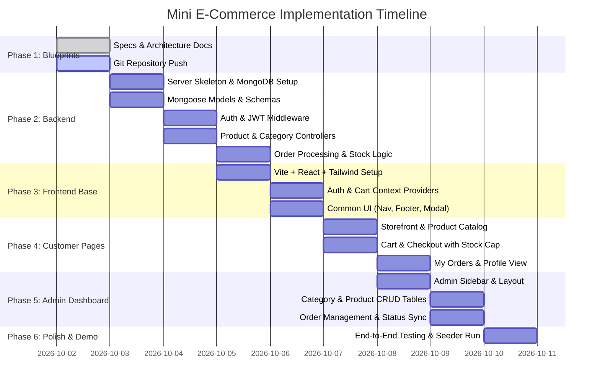

# Implementation Plan & Demo Execution Roadmap

This document outlines the step-by-step implementation milestones, development roadmap, database seeding strategy, and verification checklist for the **Mini E-Commerce Demo Project**.

---

## 📅 Phased Roadmap

---

## 🛠 Detailed Milestone Breakdown

### Milestone 1: Specifications & Documentation (Completed)
- [x] Create project `README.md` with features, stack, and demo workflow.
- [x] Write `docs/ARCHITECTURE.md` with system design and sequence diagrams.
- [x] Write `docs/API_SPECIFICATION.md` detailing all endpoints and payloads.
- [x] Write `docs/DATABASE_MODELS.md` defining Mongoose schemas and ERD.
- [x] Write `docs/FRONTEND_SPECIFICATION.md` with Tailwind styling and page breakdown.
- [x] Write `docs/IMPLEMENTATION_PLAN.md` with tasks and test scripts.
- [ ] Push documentation to remote GitHub repository.

---

### Milestone 2: Backend Setup (`/server`)
1. **Initialize Node.js Project**:
   * Dependencies: `express`, `mongoose`, `dotenv`, `cors`, `bcryptjs`, `jsonwebtoken`
   * Dev dependencies: `nodemon`
2. **Database Connection (`src/config/db.js`)**:
   * Connect to local MongoDB or MongoDB Atlas URI from `.env`.
3. **Mongoose Models (`src/models/`)**:
   * `User.js` (with bcrypt hash hook)
   * `Category.js`
   * `Product.js` (with text indexing for search)
   * `Order.js` (with embedded items and address)
4. **Middlewares (`src/middleware/`)**:
   * `authMiddleware.js`: Verifies `Authorization: Bearer <token>`, attaches `req.user`.
   * `adminMiddleware.js`: Validates `req.user.role === 'admin'`.
   * `errorMiddleware.js`: Centralized JSON error response handler.
5. **Controllers & Routes (`src/controllers/` & `src/routes/`)**:
   * `authController.js` (`POST /api/auth/register`, `POST /api/auth/login`)
   * `categoryController.js` (CRUD operations)
   * `productController.js` (Listing with category/search filters, CRUD)
   * `orderController.js` (Order creation with DB price verification, stock reduction, status updater)
6. **Data Seeder Utility (`src/utils/seeder.js`)**:
   * Seeds default admin account (`admin@demo.com` / `admin123`).
   * Seeds initial categories (`Electronics`, `Fashion`, `Shoes`).
   * Seeds demo products with sample stock and Unsplash image URLs.

---

### Milestone 3: Frontend Foundation (`/client`)
1. **Scaffold React App with Vite**:
   * Setup `client/` using Vite React template.
   * Install and configure `tailwindcss`, `postcss`, `autoprefixer`.
   * Install dependencies: `axios`, `react-router-dom`, `lucide-react`, `react-hot-toast`.
2. **State Management**:
   * `AuthContext.jsx`: Persists user object and JWT in `localStorage`. Provides `login()`, `logout()`, `register()`, and `isAdmin` flag.
   * `CartContext.jsx`: Persists cart items in `localStorage`. Controls `addToCart()`, `updateQuantity()` (clamped to available stock), `removeFromCart()`, and `clearCart()`.
3. **API Client Layer (`src/services/api.js`)**:
   * Configures Axios base URL `http://localhost:5000/api`.
   * Configures request interceptor to auto-inject `Authorization: Bearer <token>`.
   * Configures response interceptor to handle `401 Unauthorized` redirects.

---

### Milestone 4: Customer Storefront Implementation
1. **Navbar & Footer**:
   * Responsive navigation, real-time cart count badge, user profile menu.
2. **Home Page (`Home.jsx`)**:
   * Hero banner, category shortcut pills, featured product grid.
3. **Products Page (`Products.jsx`)**:
   * Search input with live query matching.
   * Category pill filters (`All`, `Electronics`, `Fashion`, `Shoes`).
   * Responsive product grid with stock indicators and "Add to Cart" triggers.
4. **Product Details Page (`ProductDetails.jsx`)**:
   * Image gallery, description, stock status, and quantity stepper.
5. **Cart Page (`Cart.jsx`)**:
   * Item rows with subtotal calculation, quantity stepper, remove button.
   * Order summary sidebar with "Proceed to Checkout" button.
6. **Checkout Page (`Checkout.jsx`)**:
   * Shipping details form, Cash on Delivery badge, and place order button.
7. **My Orders Page (`MyOrders.jsx`)**:
   * Order card list displaying order status, purchased items, and total amount.

---

### Milestone 5: Admin Panel Implementation
1. **Admin Layout (`AdminLayout.jsx`)**:
   * Sidebar navigation links with active state indicator.
   * Route protection: redirects non-admin users to `/login`.
2. **Category Management (`AdminCategories.jsx`)**:
   * Data table displaying all categories.
   * "Add Category" modal and "Edit Category" modal.
   * Deletion confirmation dialog.
3. **Product Management (`AdminProducts.jsx`)**:
   * Catalog table with thumbnails, stock levels, and price tags.
   * "Add / Edit Product" modal with image preview and category dropdown.
   * Low-stock warnings when `stock < 5`.
4. **Order Fulfillment (`AdminOrders.jsx`)**:
   * Full order table with customer name, shipping info, and items.
   * Status change dropdown (`Pending` -> `Confirmed` -> `Shipped` -> `Delivered` -> `Cancelled`).

---

## 🧪 End-to-End Demo Verification Checklist

| Step # | Action | Expected Result | Pass/Fail |
| :---: | :--- | :--- | :---: |
| 1 | Run backend seeder (`node src/utils/seeder.js`) | Database populated with admin, sample categories, and products | [ ] |
| 2 | Login as Admin (`admin@demo.com` / `admin123`) | Authenticated successfully; redirected to `/admin` dashboard | [ ] |
| 3 | Admin creates Category "Accessories" | Category added to MongoDB and visible in category table | [ ] |
| 4 | Admin creates Product "Smart Watch" (Stock: 5, Price: $99) | Product created and linked to "Accessories" | [ ] |
| 5 | Visit Public Storefront as Guest | "Smart Watch" visible in catalog with category badge | [ ] |
| 6 | Register new Customer (`test@customer.com`) | Customer account created and JWT stored in browser | [ ] |
| 7 | Filter by Category "Accessories" | Catalog displays only accessories | [ ] |
| 8 | Search for "Smart Watch" | Live search filters to the product | [ ] |
| 9 | Add 2 units of "Smart Watch" to Cart | Cart badge updates to 2; cart drawer reflects subtotal | [ ] |
| 10 | Attempt to increase quantity to 6 | Stepper prevents quantity > 5 (max stock limit) | [ ] |
| 11 | Proceed to Checkout and enter Address | Shipping details captured, payment set to "Cash on Delivery" | [ ] |
| 12 | Place Order | Order placed; MongoDB stock drops from 5 to 3; cart cleared | [ ] |
| 13 | Visit "My Orders" | New order displayed with status "Pending" | [ ] |
| 14 | Open Admin Orders panel | Admin sees the order from `test@customer.com` | [ ] |
| 15 | Update Order Status to "Shipped" | Status updates in DB; reflected in both Admin and Customer views | [ ] |
